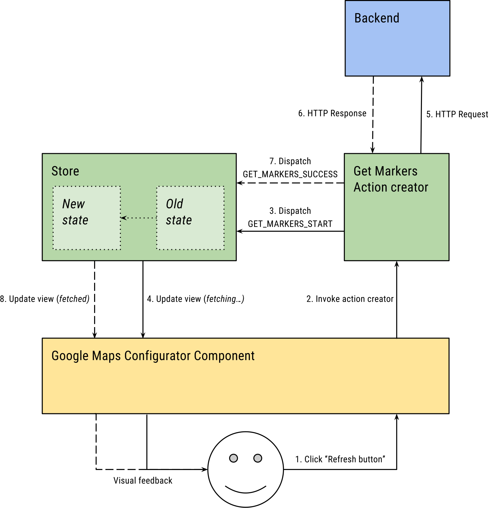

Frontend architecture
=====================

The frontend itself can be viewed as a standalone application that has its own inner architecture. It is responsible for rendering the user interface which involves many not so simple tasks, including transitions between individual screen, processing user input, processing backend responses (including the the failed ones) and of course visualizations themselves. The architecture is also important because it defines the way the frontend can be extended with new *visualizers*.

*Figure 1*

The frontend actually consists of several standalone Single-page applications, as Figure 1 suggests. There is one big *platform* SPA, which contains *configurator interfaces* for all *visualizers*, and then for each *visualizer* there is a small dedicated SPA, which contains only the *application interface* for that particular *visualizer*. The *platform* SPA covers the overall generator agenda which includes most importantly generating and configuring applications. Each *visualizer* SPA, on the other hand, is responsible only for rendering published application of that particular type.

When a published application is accessed, depending on the *visualizer*, the appropriate SPA is loaded. On the other hand, the *platform* SPA needs to deal with this problem dynamically, using an internal mechanism that loads the appropriate *configurator interface* on demand. This mechanism will be described later in this subsection.

## Flux/Redux cycle

*Figure 2*

The inner frontend architecture follows the Flux  pattern, or specifically the Redux  mutation of Flux. The core idea is a unidirectional data flow, as shown on Figure 2. Let us take an example of how this pattern deals with user interactions. Let us say that the user clicks a button to increase a counter’s value. This is what would happen:

1.  The user clicks the button

2.  The *controller-view* layer intercepts that interaction and dispatches an appropriate *action* to the *store*.

3.  The *store* updates the *state* using the *action* and notifies the *controller-view* layer of the change.

4.  The *controller-view* updates itself using the new *state* which results in a change on the screen.

The *state* is a single hierarchically structured object that holds the complete state of the user interface, i.e., what the user sees on the screen is a function of the *state*. The *controller-view* layer both defines how the user interface, given the *state*, should look like and how it should respond to user input. An *action* represents an event that occurs in the system. It is a structured object which is identified by a unique name and can carry a payload. To create *actions* we usually use factories called *action creators*. The *store* holds the *state*, it updates it with incoming *actions* and notifies the *controller-view* layer of changes.

It is important that the only way the *state* (and consequently the user interface) is updated, is through *actions*. That means that given an initial *state* and a sequence of *actions*, we always reach the same *state*. This aspect greatly improves the predictability of the frontend application.

*Figure 3*

As the initial example was very simple, let us take a more complex one, which involves communication with the backend. In this example, the user clicks the **Refresh** button to load updated markers from the server to be shown on a Google Map. The whole process is visualized on Figure 3. It consists of the following steps:

1.  The user clicks the **Refresh** button.

2.  The *controller-view* layer (represented by a `Google Maps Configurator Component` at this moment) intercepts the click and invokes `Get Markers Action Creator`.

3.  The *action creator* firstly dispatches the `GET_MARKERS_START` action.

4.  The *store* updates the *state* accordingly (let us say that an appropriate boolean variable `loading` is flipped to `true`) and informs the *controller-view* layer of this change which results in a user interface update and consequently visual feedback on the screen (e.g. the user will see an animated loading indicator).

5.  The *action creator* makes the actual HTTP request to the backend to get the markers and waits for the response.

6.  The backend responds with the markers.

7.  The *action creator* dispatches the `GET_MARKERS_SUCCESS` action with the received markers as the action payload.

8.  The *store* updates the *state* accordingly (the aforementioned variable is flipped back to `false` and the markers are stored in the state). The *controller-view* layer is notified of another changes and updates itself according to the new *state* (e.g. the loading bar is hidden and the markers are shown on the map).

## React components

*Figure 4*

Let us now talk more in detail about individual parts of this architecture. The actual user interface, i.e. the *controller-view* layer, is composed of hierarchically structured UI components, specifically React  components. We suggested how a screen with a *configurator interface* should look like. Now you can refer to Figure 4 to see how this screen would be represented with the component hierarchy.

An UI component is the base building block that we work with while creating the user interface. It works as a *view*, defining how it should be rendered on the screen, and also as a *controller*, defining how it should respond to user interactions. The main asset of this component approach is composability. One component typically consists of several smaller components, creating as many levels of abstraction as necessary. This can be nicely seen on Figure 4. One consequence is that even though we talk about a *controller-view* layer, some components are rather *controllers*, focusing on the application logic, and some are rather *views*, focusing on the visual aspect.

## The *state*, *reducers* and *selectors*

*Figure 5*

The *state* is similarly structured as the user interface, even though the hierarchies are not identical. Figure 5 gives the reader an idea of what kind of information the *state* actually contains and how this information is mapped to the user interface.

The role of the *state* is similar to how RDBMS is used in the backend. It works as a structured storage of data (instead of tables we have an arbitrarily deep nested hierarchy). Whereas in backend repositories typically work as the first abstraction layer through which the RDBMS is accessed, in frontend we utilize *reducers* to define how the *state* should be updated using *action*, and *selectors* to select specific data from the *state*. Note that both *reducers* and *selectors* always work only on a single piece of the whole *state*.

Figure \[fig:frontend-reducer-and-selector\] shows how these concepts are utilized in a real situation. After successful authentication with the backend, the `SIGN_IN` action carrying the current user is dispatched. The `User Reducer` updates the *state* (stores the authenticated user) and the *User Selector* selects the user from the *state* and passes it to a UI component.

*Figure 6*

There is a clear analogy between repositories and the combination of *actions*, *reducers* and *selectors*. *Actions* define API for updates (setters), *selectors* for reads (getters). *Reducers* represent the actual implementations of the setters. *Action creators*, on the other hand, constitute a higher level of abstraction as they handle more complex tasks from the business logic (such as communication with the backend, as shown in the example on Figure 3).

Whereas in backend all this functionality is tightly bundled in a single repository or service object (object as in OOP), in backend the individual parts are represented as functions that are coupled only loosely. Nevertheless, we use a name *duck* to refer to a unit of related *actions*, *action creators*, *selectors* and *reducers* that cover a limited functionality (e.g. users). Just as there are different repositories and services in backend, having different responsibilities, there are different *ducks* in frontend. Here are some examples (the *state* structure on Figure 5 might have already given some ideas to the user):

-   **User** – authenticated user

-   **Dialog windows** – state of opened dialog windows

-   **Promises** – state of all asynchronous operations in the system (typically HTTP requests to the backend)

-   **Notifications** – on-screen user notifications

-   **Discovery** – state of the currently opened discovery

-   **Published applications** – list of published applications (catalog content)

These were just some of the many that exist in the frontend, plus they are typically related to the general *platform* functionality. Then every *visualizer* would define its own *ducks*, typically responsible for fetching and storing the RDF data from the backend and for the *configuration* (as seen on Figure \[fig:frontend-state-structure\]).

## Routing

The last missing piece of the frontend architecture is routing. Despite the frontend being an SPA, standard URLs are still used for identification of different screens, i.e., by changing the current URL the user transitions to another screen. In a typical OOP MVC implementation as is used in the backend, a URL is mapped onto a controller object method. In our frontend application, each URL is mapped on a hierarchy of UI components.

Let us consider the screen with Google Maps Visualizer *configurator interface* with component structure shown on Figure 4 Note that this applies only to the *platform* SPA. The URL of this screen is `/app/13/googleMaps`. The mapping on a component hierarchy would be following:

-   `app` – `Configurator Loader` component

-   `13` – the ID of current application. It is passed as a parameter to the `Configurator Loader` component

-   `googleMaps` – `Google Maps Configurator` component

On Figure 4 there is a `Router` component high up in the hierarchy. This component is responsible for injecting the components that map on the current URL into the hierarchy. If any segment of the URL changes, the `Router` replaces the old component with a new one that maps on the new URL segment which results in a screen update. Note the hierarchical nature of this routing approach.

This suggests how the internal mechanism for loading the appropriate *configurator interface* works. Each *visualizer* defines its own *configurator interface* in a form of a UI component which is seemingly integrated into the component hierarchy (see Figure 4 where the configurator component is highlighted with a dotted border). Each such component maps on a unique URL. When a user decides to configure an application, he is redirected to this URL and the *Router* activates the appropriate component.